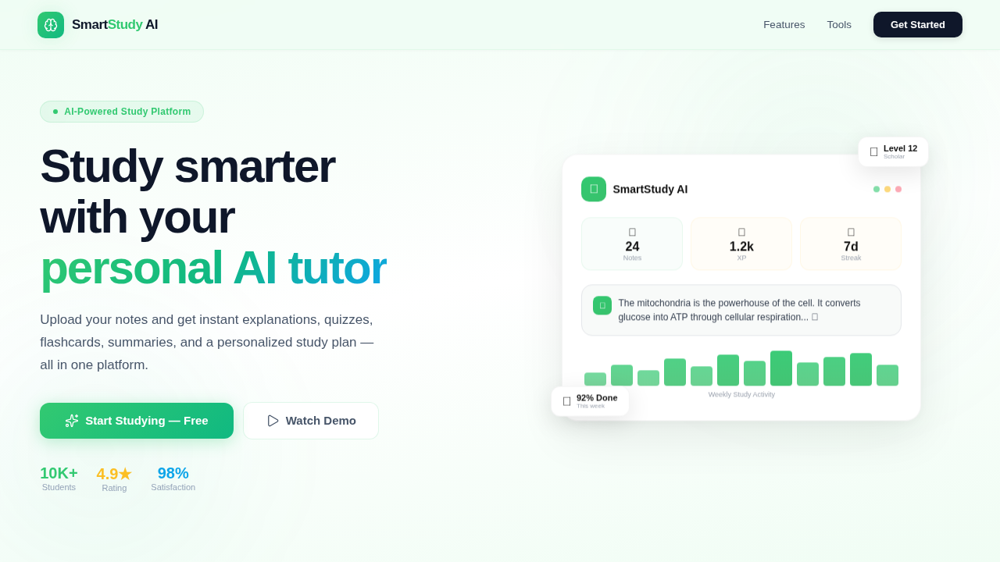
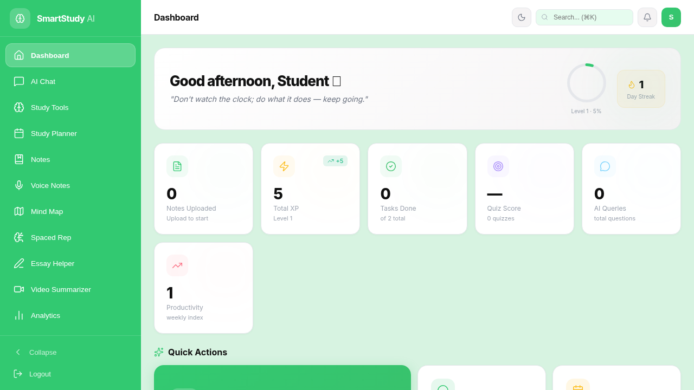
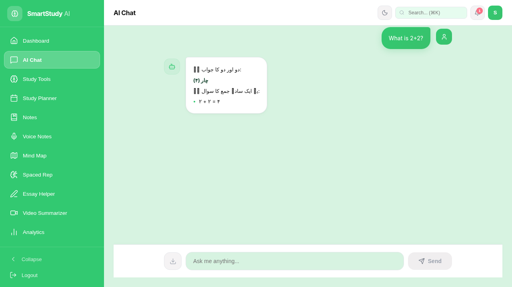
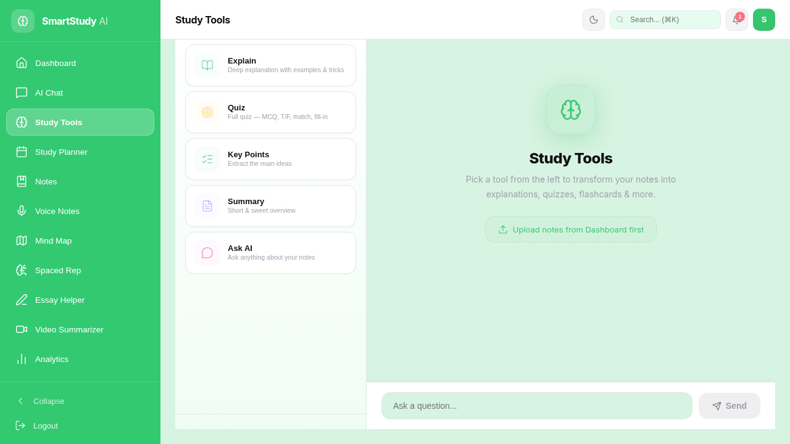
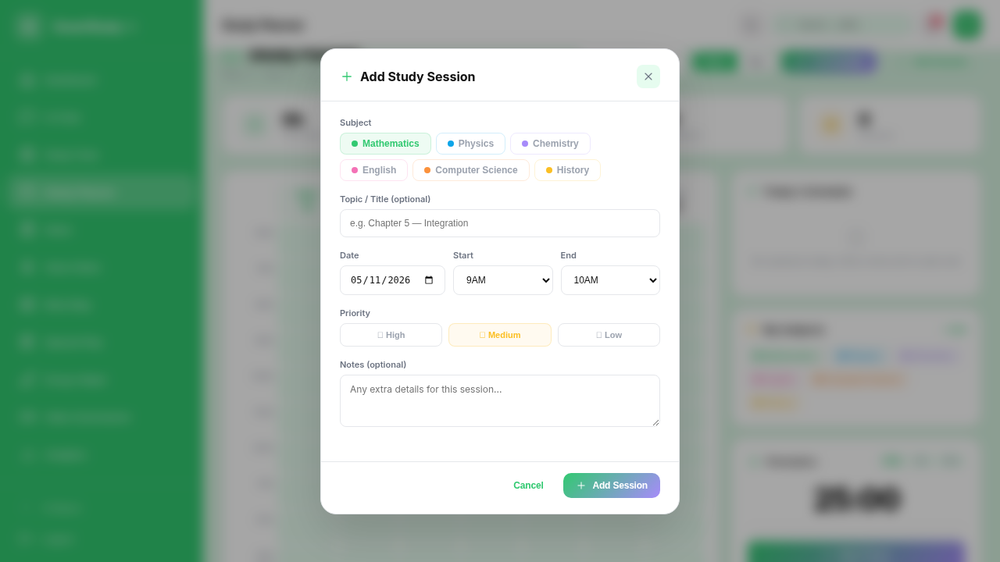
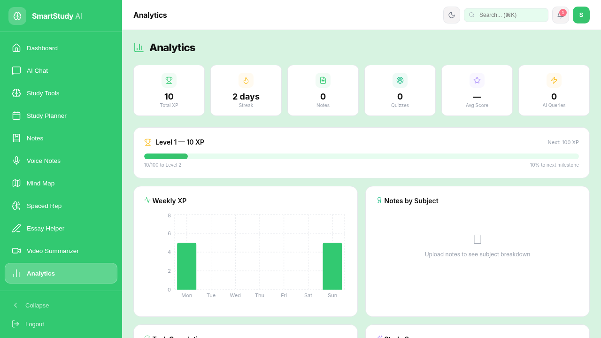

# 🎓 AI Study Assistant (SmartStudy AI)

An AI-powered study assistant web application that helps students learn smarter with AI chat, study planning, notes management, flashcards, mind maps, analytics tracking, and more. Built with React, Vite, and Node.js featuring a modern UI with dark/light theme support and full mobile responsiveness.

---

## 🚀 Live Demo

[View Live Demo](https://ai-study-assistant-t9ku2h.drytis.dev/)

---

## 📸 Screenshots

| Landing Page | Dashboard |
|:---:|:---:|
|  |  |

| AI Chat | Study Tools |
|:---:|:---:|
|  |  |

| Study Planner | Analytics |
|:---:|:---:|
|  |  |

---

## ✨ Features

### 🤖 AI Chat
- Intelligent AI-powered study assistant chat
- Context-aware responses for academic topics
- Chat history and conversation management
- Export chat conversations

### 📚 Study Tools
- **Flashcards** — Create and review flashcard decks
- **Mind Maps** — Visualize concepts with interactive mind maps
- **Quizzes** — Test your knowledge with auto-generated quizzes
- **Summarizer** — Summarize long texts into key points

### 📅 Study Planner
- Plan and schedule study sessions
- Calendar view with subject organization
- Set reminders and track progress
- Weekly and daily planning views

### 📝 Notes Management
- Create, edit, and organize notes by subject
- Upload PDF and DOCX files
- Voice notes with recording support
- OCR text extraction from images (Tesseract.js)
- Export notes as PDF

### 📊 Analytics Dashboard
- Track study time, XP, and streaks
- Visual charts for study activity
- Task completion rates and progress tracking
- Achievement badges and rewards

### ✅ Task Manager
- Create, organize, and track tasks
- Priority levels and due dates
- Filter by status (pending/completed)
- Earn XP for completing tasks

### ⚙️ Settings
- Account, AI & Study, Study, Alerts, Privacy, Performance, Developer, Access
- Dark/Light theme toggle

### 🎨 UI/UX
- Modern pastel mint green theme
- Full dark mode support
- Responsive design (mobile, tablet, desktop)
- Smooth animations with Framer Motion
- Command palette (Ctrl+K)
- Collapsible sidebar navigation

---

## 🛠️ Tech Stack

| Technology | Purpose |
|---|---|
| **React 19** | Frontend UI framework |
| **Vite 6** | Build tool and dev server |
| **Node.js** | Backend API server |
| **Framer Motion** | Animations and transitions |
| **Recharts** | Data visualization charts |
| **KaTeX** | Mathematical equation rendering |
| **Lucide React** | Icon library |
| **jsPDF** | PDF generation and export |
| **Mammoth.js** | DOCX file parsing |
| **Tesseract.js** | OCR text extraction from images |
| **react-pdf** | PDF viewing and rendering |
| **youtube-transcript** | YouTube video transcript fetching |

---

## ⚡ Getting Started

### Prerequisites
- **Node.js** v18+
- **npm** v9+

### Installation

```bash
git clone https://github.com/NafeesAhmedBhatti/AI-Study-Assistant.git
cd AI-Study-Assistant
npm install
npm run dev
